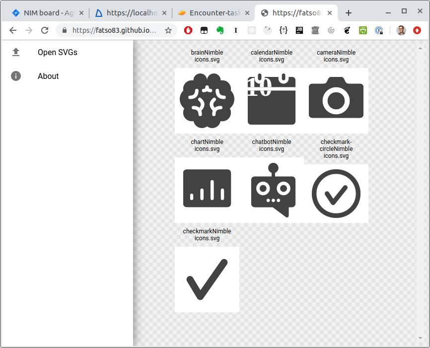

# html-svg-browser
Hard to get overview of your SVGs? No suitable program on Windows/Linux/whatevs or the SVG icons are just too tiny? 

Those were my issues. Scratch your itch [using this little tool (live demo](https://fatso83.github.io/svg-browser/).

Styling shamelessly stolen from SVGOMG.
